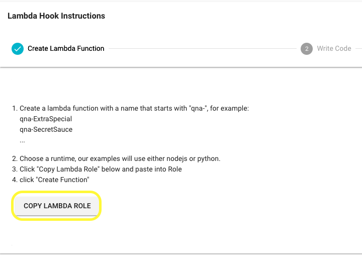
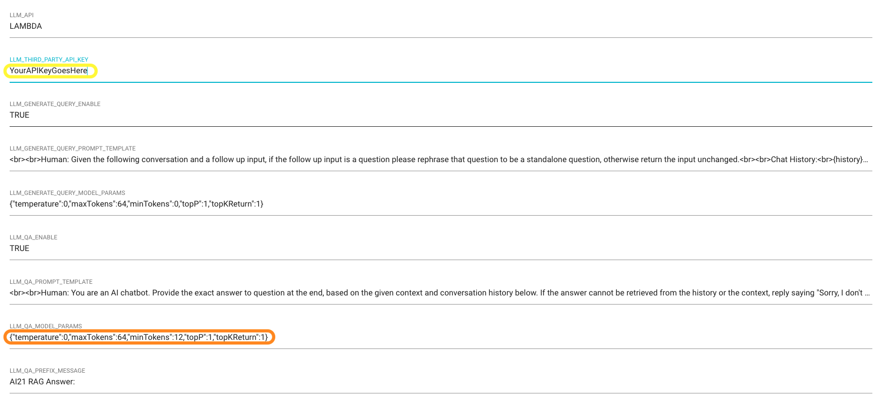

# qna-lambda-for-ai21

## Getting started

This is the add on Lambda script for QnABot that use Large Language Model to Query Disambiguation for Conversational Retrieval, and Generative Question Answering.

This Lambda script  make it easy for you to get started to integrate AI21 Public Endpoint. The function can call either make Jurrasic-2 or Task-Specific (Contextual Answers [BETA]) API call. 

## Deploy the CloudFormation Script (Installation)

- Go to [Amazon CloudFormation](https://console.aws.amazon.com/cloudformation/) 
- Create Stack, Upload this template file - ***Bot-2023-06-06.v3.yaml***
- Enter a lambda name that starts with "qna-", for example:
_qna-ExtraSpecial_

- Go to Designer Page of QnA Bot that previously deployed, and go to Lambda Hooks on left menu

- Copy the Lambda Role

- Paste the Role into functionIamRole
- Next, Next and Submit the CloudFormation Script Deployment

## Input the AI21 API Keys

- Register Account in AI21 Studio
- Copy the API Key
- Input the API Key in the Setting Page in QnABot designer Page (Follow the Yellow circle below)

## Change to Task-Specific (Contextual Answers [BETA]) API call.
- This function call __j2-jumbo-instruct/complete__ by default.
- if you would like to try the Contextual Answers API in this QnA bot, floow the steps below

1. Backup you prompt text in __LLM_QA_PROMPT_TEMPLATE__
2. Change the __LLM_QA_PROMPT_TEMPLATE__ to `{context}||question:{query}`
3. Update the __LLM_QA_MODEL_PARAMS__  to `{"temperature":0,"maxTokens":64,"minTokens":12,"topP":1,"topKReturn":1,"contextualAnswers":"TRUE"}`

