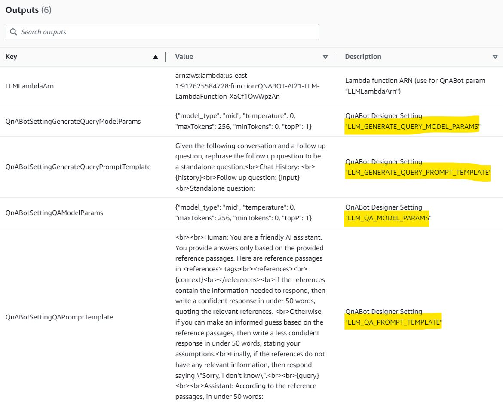
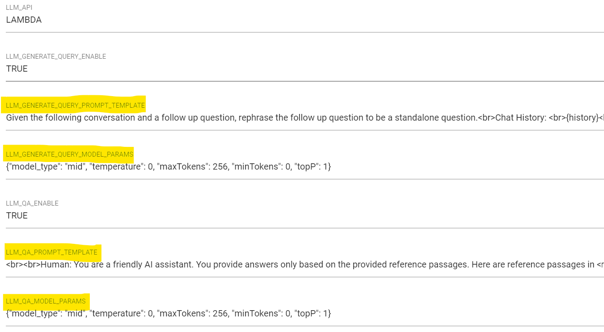
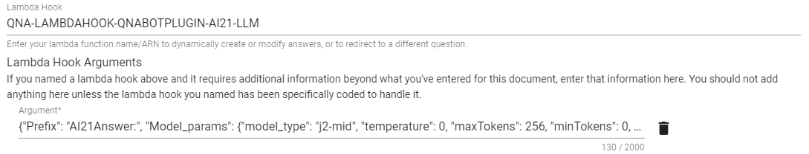
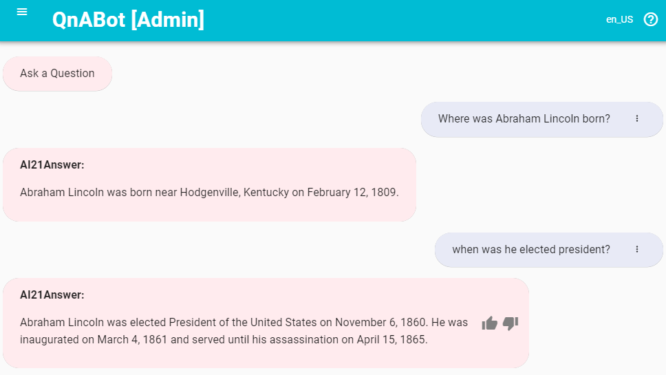

# QnABot on AWS Sample Plugins
 
This repository provides sample plugin Lambda functions for use with the [QnABot on AWS](https://aws.amazon.com/solutions/implementations/qnabot-on-aws/) solution. 

The directions below explain how to build and deploy the plugins. For more information on the QnABot solution itself, see the [QnABot on AWS Solution Implementation Guide](https://docs.aws.amazon.com/solutions/latest/qnabot-on-aws/solution-overview.html).

### Contents:

*Plugins to extend QnABot LLM integration*  
1. Amazon Bedrock Embeddings and LLM: Uses Amazon Bedrock service API
2. AI21 LLM: Uses AI21's Jurassic model API - requires an AI21 account with an API Key
3. Anthropic LLM: Uses Anthropic's Claude model API - requires an Anthropic account with an API Key
4. Llama 2 13b Chat LLM: Uses Llama 2 13b Chat model - requires Llama-2-chat model to be deployed via SageMaker JumpStart. Refer to [Llama 2 foundation models from Meta are now available in Amazon SageMaker JumpStart](https://aws.amazon.com/blogs/machine-learning/llama-2-foundation-models-from-meta-are-now-available-in-amazon-sagemaker-jumpstart/) on how to deploy the Llama-2-chat model in SageMaker JumpStart. 
5. Mistral 7b Instruct LLM: Uses Mistral 7b Instruct model - requires Mistral 7b Instruct model to be deployed via SageMaker JumpStart. Refer to [Mistral 7B foundation models from Mistral AI are now available in Amazon SageMaker JumpStart](https://aws.amazon.com/blogs/machine-learning/mistral-7b-foundation-models-from-mistral-ai-are-now-available-in-amazon-sagemaker-jumpstart/) on how to deploy the Mistral 7B Instruct model in SageMaker JumpStart. 
6. Amazon Q, your business expert: Integrates Amazon Q, your business expert (preview) with QnABot as a fallback answer source, using QnAbot's Lambda hooks with CustomNoMatches/no_hits. For more information see: [QnABot LambdaHook for Amazon Q, your business expert (preview)](./lambdas/qna_bot_qbusiness_lambdahook/README.md)

### (optional) Build and Publish QnABot Plugins CloudFormation artifacts

_Note: Perform this step only if you want to create deployment artifacts in your own account. Otherwise, we have hosted a CloudFormation template for 1-click deployment in the [deploy](#deploy) section_.

*Pre-requisite*: You must already have the [AWS CLI](https://docs.aws.amazon.com/cli/latest/userguide/cli-chap-install.html) installed and configured. You can use an AWS Cloud9 environment.

Copy the plugins GitHub repo to your local machine.  
Either:  
 - use the `git` command: `git clone https://github.com/aws-samples/qnabot-on-aws-plugin-samples.git`
 - OR, download and expand the ZIP file from the GitHub page: https://github.com/aws-samples/qnabot-on-aws-plugin-samples/archive/refs/heads/main.zip

Then use the [publish.sh](./publish.sh) bash script in the project root directory to build the project and deploy CloudFormation templates to your own deployment bucket.

Run the script with up to 3 parameters:
```
./publish.sh <cfn_bucket> <cfn_prefix> [public]

- <cfn_bucket>: name of S3 bucket to deploy CloudFormation templates and code artifacts. If bucket does not exist, it will be created.
- <cfn_prefix>: artifacts will be copied to the path specified by this prefix (path/to/artifacts/)
- public: (optional) Adding the argument "public" will set public-read acl on all published artifacts, for sharing with any account.
```

To deploy to a non-default region, set environment variable `AWS_DEFAULT_REGION` to a region supported by QnABot. See: [Supported AWS Regions](https://docs.aws.amazon.com/solutions/latest/qnabot-on-aws/supported-aws-regions.html) 
E.g. to deploy in Ireland run `export AWS_DEFAULT_REGION=eu-west-1` before running the publish script. 

It downloads package dependencies, builds code zipfiles, and copies templates and zip files to the cfn_bucket.
When completed, it displays the CloudFormation templates S3 URLs and 1-click URLs for launching the stack creation in CloudFormation console, e.g.:
```
------------------------------------------------------------------------------
Outputs
------------------------------------------------------------------------------
QNABOTPLUGIN-AI21-LLM
==============
 - Template URL: https://s3.us-east-1.amazonaws.com/xxxxx-cfn-bucket/qnabot-plugins/ai21-llm.yaml
 - Deploy URL:   https://us-east-1.console.aws.amazon.com/cloudformation/home?region=us-east-1#/stacks/create/review?templateURL=https://s3.us-east-1.amazonaws.com/xxxxx-cfn-bucket/qnabot-plugins/ai21-llm.yaml&stackName=QNABOTPLUGIN-AI21-LLM

QNABOTPLUGIN-ANTHROPIC-LLM
==============
 - Template URL: https://s3.us-east-1.amazonaws.com/xxxxx-cfn-bucket/qnabot-plugins/anthropic-llm.yaml
 - Deploy URL:   https://us-east-1.console.aws.amazon.com/cloudformation/home?region=us-east-1#/stacks/create/review?templateURL=https://s3.us-east-1.amazonaws.com/xxxxx-cfn-bucket/qnabot-plugins/anthropic-llm.yaml&stackName=QNABOTPLUGIN-ANTHROPIC-LLM

QNABOTPLUGIN-BEDROCK-EMBEDDINGS-LLM
==============
 - Template URL: https://s3.us-east-1.amazonaws.com/xxxxx-cfn-bucket/qnabot-plugins/bedrock-embeddings-llm.yaml
 - Deploy URL:   https://us-east-1.console.aws.amazon.com/cloudformation/home?region=us-east-1#/stacks/create/review?templateURL=https://s3.us-east-1.amazonaws.com/xxxxx-cfn-bucket/qnabot-plugins/bedrock-embeddings-llm.yaml&stackName=QNABOTPLUGIN-BEDROCK-EMBEDDINGS-LLM

QNABOTPLUGIN-LLAMA-2-13B-CHAT-LLM
==============
 - Template URL: https://s3.us-east-1.amazonaws.com/xxxxx-cfn-bucket/qnabot-plugins/llama-2-13b-chat-llm.yaml
 - Deploy URL:   https://us-east-1.console.aws.amazon.com/cloudformation/home?region=us-east-1#/stacks/create/review?templateURL=https://s3.us-east-1.amazonaws.com/xxxxx-cfn-bucket/qnabot-plugins/llama-2-13b-chat-llm.yaml&stackName=QNABOTPLUGIN-LLAMA-2-13B-CHAT-LLM
 
 QNABOTPLUGIN-MISTRAL-7B-INSTRUCT-CHAT-LLM
 ==============
 - Template URL: https://s3.us-east-1.amazonaws.com/xxxxx-cfn-bucket/mistral-7b-instruct-chat-llm.yaml
 - Deploy URL:   https://us-east-1.console.aws.amazon.com/cloudformation/home?region=us-east-1#/stacks/create/review?templateURL=https://s3.us-east-1.amazonaws.com/xxxxx-cfn-bucket/qnabot-plugins/mistral-7b-instruct-chat-llm.yaml&stackName=QNABOTPLUGIN-MISTRAL-7B-INSTRUCT-CHAT-LLM
```

### Deploy a new Plugin stack

Use AWS CloudFormation to deploy one or more of the sample plugin Lambdas in your own AWS account (if you do not have an AWS account, please see [How do I create and activate a new Amazon Web Services account?](https://aws.amazon.com/premiumsupport/knowledge-center/create-and-activate-aws-account/)):

1. Log into the [AWS console](https://console.aws.amazon.com/) if you are not already.
*Note: Ensure that your IAM Role/User have permissions to create and manage the necessary resources and components for this application.*
2. Choose one of the **Launch Stack** buttons below for your desired LLM and AWS region to open the AWS CloudFormation console and create a new stack.
3. On the CloudFormation `Create Stack` page, click `Next`
4. Enter the following parameters:
    1. `Stack Name`: Name your stack, e.g. QNABOTPLUGIN-LLM-AI21.
    2. `APIKey`: Your Third-Party vendor account API Key, if applicable. The API Key is securely stored in AWS Secrets Manager. 
    3. `LLMModelId` and `EmbeddingsModelId` (for Bedrock), `LLMModel` (for Anthropic), `LLMModelType` (for AI21): Choose one of the available models to be used depending on the model provider.

#### <u>N. Virginia (us-east-1)</u>
Plugin | Launch Stack | Template URL
--- | --- | ---
QNABOT-BEDROCK-EMBEDDINGS-AND-LLM | [](https://us-east-1.console.aws.amazon.com/cloudformation/home?region=us-east-1#/stacks/create/review?templateURL=https://s3.us-east-1.amazonaws.com/aws-ml-blog/artifacts/qnabot-on-aws-plugin-samples/bedrock-embeddings-and-llm.yaml&stackName=QNABOTPLUGIN-BEDROCK-EMBEDDINGS-AND-LLM) | https://s3.us-east-1.amazonaws.com/aws-ml-blog/artifacts/qnabot-on-aws-plugin-samples/bedrock-embeddings-and-llm.yaml
QNABOT-AI21-LLM | [](https://us-east-1.console.aws.amazon.com/cloudformation/home?region=us-east-1#/stacks/create/review?templateURL=https://s3.us-east-1.amazonaws.com/aws-ml-blog/artifacts/qnabot-on-aws-plugin-samples/ai21-llm.yaml&stackName=QNABOTPLUGIN-AI21-LLM) | https://s3.us-east-1.amazonaws.com/aws-ml-blog/artifacts/qnabot-on-aws-plugin-samples/ai21-llm.yaml
QNABOT-ANTHROPIC-LLM | [](https://us-east-1.console.aws.amazon.com/cloudformation/home?region=us-east-1#/stacks/create/review?templateURL=https://s3.us-east-1.amazonaws.com/aws-ml-blog/artifacts/qnabot-on-aws-plugin-samples/anthropic-llm.yaml&stackName=QNABOTPLUGIN-ANTHROPIC-LLM) | https://s3.us-east-1.amazonaws.com/aws-ml-blog/artifacts/qnabot-on-aws-plugin-samples/anthropic-llm.yaml
QNABOTPLUGIN-LLAMA-2-13B-CHAT-LLM | [](https://us-east-1.console.aws.amazon.com/cloudformation/home?region=us-east-1#/stacks/create/review?templateURL=https://s3.us-east-1.amazonaws.com/aws-ml-blog/artifacts/qnabot-on-aws-plugin-samples/llama-2-13b-chat-llm.yaml&stackName=QNABOTPLUGIN-LLAMA-2-13B-CHAT-LLM) | https://s3.us-east-1.amazonaws.com/aws-ml-blog/artifacts/qnabot-on-aws-plugin-samples/llama-2-13b-chat-llm.yaml
QNABOTPLUGIN-MISTRAL-7B-INSTRUCT-CHAT-LLM | [](https://us-east-1.console.aws.amazon.com/cloudformation/home?region=us-east-1#/stacks/create/review?templateURL=https://s3.us-east-1.amazonaws.com/aws-ml-blog/artifacts/qnabot-on-aws-plugin-samples/mistral-7b-instruct-chat-llm.yaml&stackName=QNABOTPLUGIN-MISTRAL-7B-INSTRUCT-CHAT-LLM) | https://s3.us-east-1.amazonaws.com/aws-ml-blog/artifacts/qnabot-on-aws-plugin-samples/mistral-7b-instruct-chat-llm.yaml
QNABOTPLUGIN-QNA-BOT-QBUSINESS-LAMBDAHOOK | [](https://us-east-1.console.aws.amazon.com/cloudformation/home?region=us-east-1#/stacks/create/review?templateURL=https://s3.us-east-1.amazonaws.com/aws-ml-blog/artifacts/qnabot-on-aws-plugin-samples/qna_bot_qbusiness_lambdahook.yaml&stackName=QNABOTPLUGIN-QNA-BOT-QBUSINESS-LAMBDAHOOK) | https://s3.us-east-1.amazonaws.com/aws-ml-blog/artifacts/qnabot-on-aws-plugin-samples/qna_bot_qbusiness_lambdahook.yaml

#### <u>Oregon (us-west-2)</u>
Plugin | Launch Stack | Template URL
--- | --- | ---
QNABOT-BEDROCK-EMBEDDINGS-AND-LLM | [](https://us-west-2.console.aws.amazon.com/cloudformation/home?region=us-west-2#/stacks/create/review?templateURL=https://s3.us-west-2.amazonaws.com/aws-ml-blog-us-west-2/artifacts/qnabot-on-aws-plugin-samples/bedrock-embeddings-and-llm.yaml&stackName=QNABOTPLUGIN-BEDROCK-EMBEDDINGS-AND-LLM) | https://s3.us-west-2.amazonaws.com/aws-ml-blog-us-west-2/artifacts/qnabot-on-aws-plugin-samples/bedrock-embeddings-and-llm.yaml
QNABOT-AI21-LLM | [](https://us-west-2.console.aws.amazon.com/cloudformation/home?region=us-west-2#/stacks/create/review?templateURL=https://s3.us-west-2.amazonaws.com/aws-ml-blog-us-west-2/artifacts/qnabot-on-aws-plugin-samples/ai21-llm.yaml&stackName=QNABOTPLUGIN-AI21-LLM) | https://s3.us-west-2.amazonaws.com/aws-ml-blog-us-west-2/artifacts/qnabot-on-aws-plugin-samples/ai21-llm.yaml
QNABOT-ANTHROPIC-LLM | [](https://us-west-2.console.aws.amazon.com/cloudformation/home?region=us-west-2#/stacks/create/review?templateURL=https://s3.us-west-2.amazonaws.com/aws-ml-blog-us-west-2/artifacts/qnabot-on-aws-plugin-samples/anthropic-llm.yaml&stackName=QNABOTPLUGIN-ANTHROPIC-LLM) | https://s3.us-west-2.amazonaws.com/aws-ml-blog-us-west-2/artifacts/qnabot-on-aws-plugin-samples/anthropic-llm.yaml
QNABOTPLUGIN-LLAMA-2-13B-CHAT-LLM | [](https://us-west-2.console.aws.amazon.com/cloudformation/home?region=us-west-2#/stacks/create/review?templateURL=https://s3.us-west-2.amazonaws.com/aws-ml-blog-us-west-2/artifacts/qnabot-on-aws-plugin-samples/llama-2-13b-chat-llm.yaml&stackName=QNABOTPLUGIN-LLAMA-2-13B-CHAT-LLM) | https://s3.us-west-2.amazonaws.com/aws-ml-blog-us-west-2/artifacts/qnabot-on-aws-plugin-samples/llama-2-13b-chat-llm.yaml
QNABOTPLUGIN-MISTRAL-7B-INSTRUCT-CHAT-LLM | [](https://us-west-2.console.aws.amazon.com/cloudformation/home?region=us-west-2#/stacks/create/review?templateURL=https://s3.us-west-2.amazonaws.com/aws-ml-blog-us-west-2/artifacts/qnabot-on-aws-plugin-samples/mistral-7b-instruct-chat-llm.yaml&stackName=QNABOTPLUGIN-MISTRAL-7B-INSTRUCT-CHAT-LLM) | https://s3.us-west-2.amazonaws.com/aws-ml-blog-us-west-2/artifacts/qnabot-on-aws-plugin-samples/mistral-7b-instruct-chat-llm.yaml
QNABOTPLUGIN-QNA-BOT-QBUSINESS-LAMBDAHOOK | [](https://us-west-2.console.aws.amazon.com/cloudformation/home?region=us-west-2#/stacks/create/review?templateURL=https://s3.us-west-2.amazonaws.com/aws-ml-blog-us-west-2/artifacts/qnabot-on-aws-plugin-samples/qna_bot_qbusiness_lambdahook.yaml&stackName=QNABOTPLUGIN-QNA-BOT-QBUSINESS-LAMBDAHOOK) | https://s3.us-west-2.amazonaws.com/aws-ml-blog-us-west-2/artifacts/qnabot-on-aws-plugin-samples/qna_bot_qbusiness_lambdahook.yaml

## After your Plugin stack is deployed

### Configure a new or existing QnABot stack deployment to use your new LLM Plugin function

When your CloudFormation stack status is CREATE_COMPLETE, choose the **Outputs** tab
- Copy the value for `LLMLambdaArn`
- Deploy a new QnABot Stack ([instructions](https://docs.aws.amazon.com/solutions/latest/qnabot-on-aws/step-1-launch-the-stack.html)) or Update an existing QnABot stack ([instructions](https://docs.aws.amazon.com/solutions/latest/qnabot-on-aws/update-the-solution.html)), selecting **LLMApi** parameter as `LAMBDA`, and for **LLMLambdaArn** parameter enter the Lambda Arn copied above. 

For more information, see [QnABot LLM README - Lambda Function](https://github.com/aws-solutions/qnabot-on-aws/blob/main/docs/LLM_Retrieval_and_generative_question_answering/README.md#2-lambda-function) 


### Update QnABot Settings 

When the QnABot Cloudformation stack status is CREATE_COMPLETE or UPDATE_COMPLETE:
- Keep your QnABot plugins CloudFormation stack **Outputs** tab open
- In a new browser window, log into QnABot Content Designer (You can find the URL in the **Outputs** tab of your QnABot CloudFormation stack `ContentDesignerURL`). You will need to set your password for the first login.
- From the Content Designer tools (☰) menu, choose **Settings**
- From your QnABot plugins CloudFormation stack **Outputs** tab, copy setting values from each of the outputs named `QnABotSetting...`
  - use this copied value for the corresponding QnABot setting (identified in the output Description column)
  - do this for all settings. Note: the Bedrock stack has additional settings for Embeddings score thresholds.
  - Choose **Save** when complete.
       
      *Copy Stack Outputs:*  

        
      
      *To corresponding Designer Settings:*  

      
- In a new browser window, access the QnABot Client URL (You can find the URL in the **Outputs** tab of your QnABot CloudFormation stack `ClientURL`), and start interacting with the QnA bot!

### (Optional) Configure QnABot to use your new Embeddings function *(currently only available for Bedrock)*

When your CloudFormation stack status is **CREATE_COMPLETE**, choose the **Outputs** tab
- Copy the value for `EmbeddingsLambdaArn` and `EmbeddingsLambdaDimensions`
- Deploy a new QnABot Stack ([instructions](https://docs.aws.amazon.com/solutions/latest/qnabot-on-aws/step-1-launch-the-stack.html)) or Update an existing QnABot stack ([instructions](https://docs.aws.amazon.com/solutions/latest/qnabot-on-aws/update-the-solution.html)), selecting **EmbeddingsApi** as `LAMBDA`, and for **EmbeddingsLambdaArn** and **EmbeddingsLambdaDimensions** enter the Lambda Arn and embedding dimension values copied above. 

For more information, see [QnABot Embeddings README - Lambda Function](https://github.com/aws-solutions/qnabot-on-aws/tree/main/docs/semantic_matching_using_LLM_embeddings#3-lambda-function)

### (Optional) Modify Region and Endpoint URL

The default AWS region and endpoint URL are set based on the CloudFormation deployed region and the default third-party LLM provider/Bedrock endpoint URL. To override the endpoint URL:

- Once your CloudFormation stack status shows **CREATE_COMPLETE**, go to the Outputs tab and copy the Lambda Function Name [refer to green highlighted field above].
- In Lambda Functions, search for the Function Name.
- Go to the Configuration tab, edit Environment Variables, add **ENDPOINT_URL** to override the endpoint URL.

### (Optional) Modify Third Party API Keys in Secrets Manager

When your CloudFormation stack status is CREATE_COMPLETE, choose the **Outputs** tab. Use the link for `APIKeySecret` to open AWS Secrets Manager to inspect or edit your API Key in `Secret value`.

### Use the LLM as a fallback source of answers, using Lambda hooks with CustomNoMatches/no_hits

Optionally configure QnAbot to prompt the LLM directly by configuring the LLM Plugin LambdaHook function `QnAItemLambdaHookFunctionName` as a Lambda Hook for the QnABot [CustomNoMatches](https://docs.aws.amazon.com/solutions/latest/qnabot-on-aws/keyword-filters-and-custom-dont-know-answers.html) `no_hits` item. When QnABot cannot answer a question by any other means, it reverts to the `no_hits` item, which, when configured with this Lambda Hook function, will relay the question to the LLM.  

When your Plugin CloudFormation stack status is CREATE_COMPLETE, choose the **Outputs** tab. Look for the outputs `QnAItemLambdaHookFunctionName` and `QnAItemLambdaHookArgs`. Use these values in the LambdaHook section of your no_hits item. You can change the value of "Prefix', or use "None" if you don't want to prefix the LLM answer.

The default behavior is to relay the user's query to the LLM as the prompt. If LLM_QUERY_GENERATION is enabled, the generated (disambiguated) query will be used, otherwise the user's utterance is used.  You can override this behavior by supplying an explicit `"Prompt"` key in the `QnAItemLambdaHookArgs` value. For example setting `QnAItemLambdaHookArgs` to `{"Prefix": "LLM Answer:", "Model_params": {"modelId": "anthropic.claude-instant-v1", "temperature": 0}, "Prompt":"Why is the sky blue?"}` will ignore the user's input and simply use the configured prompt instead. Prompts supplied in this manner do not (yet) support variable substitution (eg to substitute user attributes, session attributes, etc. into the prompt). If you feel that would be a useful feature, please create a feature request issue in the repo, or, better yet, implement it, and submit a Pull Request!  

Currently the Lambda hook option has been implemented only in the Bedrock, AI21, and (new!) AmazonQ (Business) plugins.  
For more infomation on the Amazon Q plugin, see [QnABot LambdaHook for Amazon Q, your business expert (preview)](./lambdas/qna_bot_qbusiness_lambdahook/README.md)


  
  



## Security

See [CONTRIBUTING](CONTRIBUTING.md#security-issue-notifications) for more information.

## License

This library is licensed under the MIT-0 License. See the LICENSE file.
