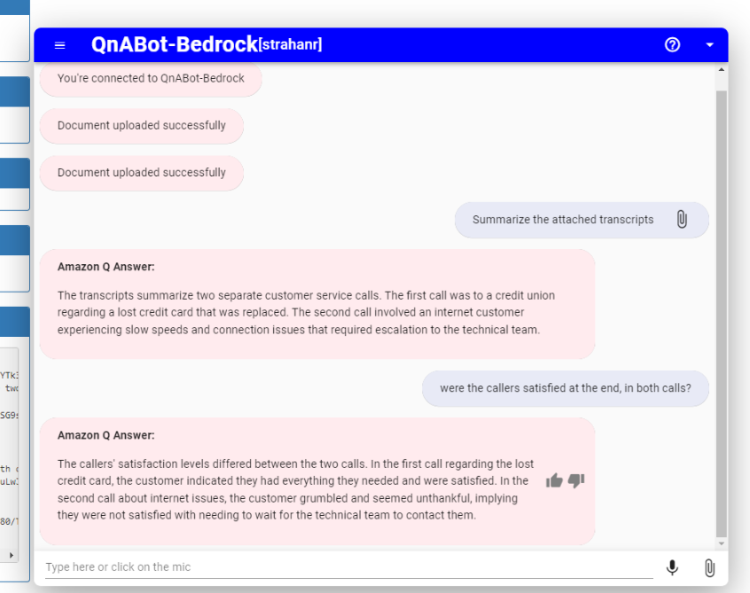

# QnABot LambdaHook for Amazon Q, your business expert (preview)

Amazon Q is a new generative AI-powered application that helps users get work done. Amazon Q can become your tailored business expert and let you discover content, brainstorm ideas, or create summaries using your company’s data safely and securely. For more information see: [Introducing Amazon Q, a new generative AI-powered assistant (preview)](https://aws.amazon.com/blogs/aws/introducing-amazon-q-a-new-generative-ai-powered-assistant-preview)

In this repo we share a project which lets you use Amazon Q's generative AI to enable QnABot users to access your organization's data and knowledge sources via conversational question-answering. You can connect to your organization data via data source connectors and integrate it with the QnABot LambdaHook plugin for Amazon Q to enable access to your QnABot users. It allows your users to converse with Amazon Q using QnABot to ask questions and get answers based on company data, get help creating new content such as emails, and performing tasks. 

NEW! This plugin now supports attachments! Use the newest version of the [Lex Web UI](http://amazon.com/chatbotui) - version 0.20.4 or later - to add local file attachments to your conversation. There's more information on this feature in the Lex Web UI [File Upload README](https://github.com/aws-samples/aws-lex-web-ui/blob/master/README-file-upload.md). 

It's pretty cool. It's easy to deploy in your own AWS Account, and add to your own QnABot. We show you how below.

## Deploy Amazon Q (your business expert) as a fallback source of answers, using Lambda hooks with CustomNoMatches/no_hits

### Deploy a new Amazon Q (Business) Plugin stack

Use AWS CloudFormation to deploy one or more of the sample plugin Lambdas in your own AWS account (if you do not have an AWS account, please see [How do I create and activate a new Amazon Web Services account?](https://aws.amazon.com/premiumsupport/knowledge-center/create-and-activate-aws-account/)):

1. Log into the [AWS console](https://console.aws.amazon.com/) if you are not already.
*Note: Ensure that your IAM Role/User have permissions to create and manage the necessary resources and components for this application.*
2. Choose one of the **Launch Stack** buttons below for your desired AWS region to open the AWS CloudFormation console and create a new stack.
3. On the CloudFormation `Create Stack` page, click `Next`
4. Enter the following parameters:
    1. `Stack Name`: Name your stack, e.g. QNABOTPLUGIN-QNA-BOT-QBUSINESS-LAMBDAHOOK.
    2. `AmazonQAppId`: Existing Amazon Q Application ID (copy from AWS console)
    3. `AmazonQUserId`: Amazon Q User ID (leave empty to use authenticated bot users' email as user Id) - see note below
    4. `AmazonQRegion`: Amazon Q Region (us-east-1, or us-west-2)
    5. `AmazonQEndpointUrl`: (Optional) Amazon Q Endpoint (leave empty for default endpoint)

*Note on UserId:*  
You have two options:  
1. (Default) Map each bot user's email to a Q Business userid. This means that each QnAbot user must be an authenticated user (e.g. logged in via Cognito using Lex Web UI). ACLs will be observed per user. This is the default setup.
2. (Proxy) Alternatively, when you deploy you can choose a single email to use when QnABot invokes Amazon Q. This removes the need for QnABot users to be authenticated (logged in), but it also means that no per-user ACLs are supported since ACLS will be based on the single proxy userId.

#### <u>N. Virginia (us-east-1)</u>
Plugin | Launch Stack | Template URL
--- | --- | ---
QNABOTPLUGIN-QNA-BOT-QBUSINESS-LAMBDAHOOK |  | https://s3.us-east-1.amazonaws.com/aws-ml-blog/artifacts/qnabot-on-aws-plugin-samples/qna_bot_qbusiness_lambdahook.yaml

#### <u>Oregon (us-west-2)</u>
Plugin | Launch Stack | Template URL
--- | --- | ---
QNABOTPLUGIN-QNA-BOT-QBUSINESS-LAMBDAHOOK |  | https://s3.us-west-2.amazonaws.com/aws-ml-blog-us-west-2/artifacts/qnabot-on-aws-plugin-samples/qna_bot_qbusiness_lambdahook.yaml

## After your Amazon Q Plugin stack is deployed
Configure QnAbot to prompt Amazon Q directly by configuring the AmazonQ LambdaHook function `QnAItemLambdaHookFunctionName` as a Lambda Hook for the QnABot [CustomNoMatches](https://docs.aws.amazon.com/solutions/latest/qnabot-on-aws/keyword-filters-and-custom-dont-know-answers.html) `no_hits` item. When QnABot cannot answer a question by any other means, it reverts to the `no_hits` item, which, when configured with this Lambda Hook function, will relay the question to Amazon Q.  

***When integrating Amazon Q in this way, you will (almost definately) want to use it instead of using the Kendra/LLM RAG approach, since Amazon Q offers an alternive approach - you are unlikely to need both. Use QnABot Content Designer Settings to remove any Kendra index specified in the setting: `ALT_SEARCH_KENDRA_INDEXES`*** 

When your QNABOTPLUGIN-QNA-BOT-QBUSINESS-LAMBDAHOOK Plugin CloudFormation stack status is CREATE_COMPLETE, choose the **Outputs** tab. Look for the outputs `QnAItemLambdaHookFunctionName` and `QnAItemLambdaHookArgs`. Use these values in the LambdaHook section of your no_hits item. You can change the value of "Prefix', or use "None" if you don't want to prefix the LLM answer.

The default behavior is to relay the user's query to Amazon Q Business as the user input. If LLM_QUERY_GENERATION is enabled, the generated (disambiguated) query will be used, otherwise the user's utterance is used.  
Alternatively, you can supply an explicit `"Prompt"` key in the `QnAItemLambdaHookArgs` value. For example setting `QnAItemLambdaHookArgs` to `{"Prefix":"Amazon Q Answer:", "ShowContextText":true, "ShowSourceLinks":true, "Prompt":"Why is the sky blue?"}` will ignore the user's input and simply use the configured prompt instead. You may find this useful if you use the function as a Lambda Hook for QnA items that match explicit lists of utterances/questions, and you want to normalise these into a single static question to ask Amazon Q. Prompts supplied in this manner do not (yet) support variable substitution (eg to substitute user attributes, session attributes, etc. into the prompt). If you feel that would be a useful feature, please create a feature request issue in the repo, or, better yet, implement it, and submit a Pull Request!  

### Say hello
> Time to say Hi!

1. Go to QnAbot
2. Launch the Web client
4. Say *Hello*. And start asking questions!
5. Enjoy.

### Using file attachments

This plugin now supports attachments! Use the newest version of the [Lex Web UI](http://amazon.com/chatbotui) - version 0.20.4 or later - to add local file attachments to your conversation. There's more information on this feature in the Lex Web UI [File Upload README](https://github.com/aws-samples/aws-lex-web-ui/blob/master/README-file-upload.md). 
When deploying or updating your Lex Web UI, you can reuse QnABot's existing **ImportBucket** name as the **UploadBucket** parameter - it already has a CORS policy that will work, and the Q Business plugin lambda role already grants read access to uploads in this bucket. To find your QnaBot's ImportBucket, use the `Resources` tab in the QnABot stack to search for the bucket reasorce with the logical name **ImportBucket**.

Here's an example of what you can do with attachments - it is a beautiful thing!

